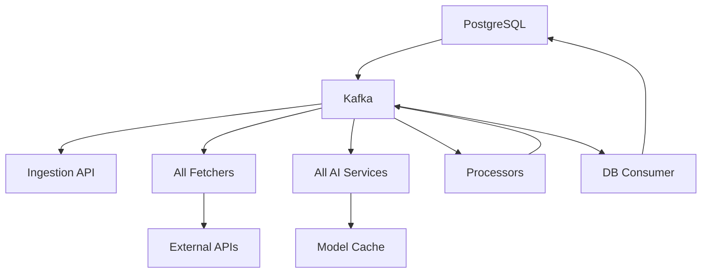

# Complete Docker Compose Development Environment

## 🎯 Problem Solved

The Docker Compose development environment was **missing all fetcher services** that were previously only available in the Kubernetes/Tilt setup. This created an incomplete development experience where core data ingestion wasn't working.

## ✅ Solution Implemented

Added **all missing services** to `docker-compose.local.yml` to create a complete development environment:

### 📊 Data Fetcher Services (4 Added)
- **hackernews-fetcher** - Fetches HackerNews favorites (15min intervals)
- **email-fetcher** - Fetches email events (5min intervals)
- **calendar-fetcher** - Fetches calendar events (10min intervals)
- **x-likes-fetcher** - Fetches X/Twitter likes (30min intervals)

### ⚙️ Processing Services (3 Added)
- **hackernews-url-processor** - Processes HN URLs into content
- **x-url-processor** - Processes Twitter URLs into content
- **kafka-to-db-consumer** - Persists all data to TimescaleDB

### 🧠 Additional AI Services (2 Added)
- **bud-e-emotion** - Audio emotion analysis (port 8004)
- **face-emotion** - Facial emotion analysis (port 8005)

## 🏗️ Architecture Benefits

### Before: Incomplete Pipeline
```
HTTP Request → Ingestion API → Kafka → ❌ (no consumers)
```

### After: Complete End-to-End Pipeline
```
External Data Sources → Fetchers → Kafka → AI Processing → Database
     ↓                    ↓         ↓         ↓            ↓
- HackerNews         hackernews    topics    VAD/STT      TimescaleDB
- Email              email         →         Vision       PostgreSQL
- Calendar           calendar               Emotion
- Twitter/X          x-likes                Reasoning

HTTP Requests → Ingestion API → Kafka → (same pipeline)
```

## 🚀 Development Workflow

### Start Complete Environment
```bash
make dev-compose-up
```

### All Services Available
```
Core Services:
  - Pipeline Monitor: http://localhost:3000
  - Pipeline Monitor API: http://localhost:8082
  - Ingestion API: http://localhost:8000
  - Kafka UI: http://localhost:8081
  - PostgreSQL: localhost:5432
  - Kafka: localhost:9092

AI Services:
  - Silero VAD: http://localhost:8001
  - Parakeet TDT (STT): http://localhost:8002
  - MiniCPM Vision: http://localhost:8003
  - BUD-E Emotion: http://localhost:8004
  - Face Emotion: http://localhost:8005

Data Fetchers:
  - HackerNews Fetcher (15min intervals)
  - Email Fetcher (5min intervals)
  - Calendar Fetcher (10min intervals)
  - X/Twitter Likes Fetcher (30min intervals)

Processing Services:
  - HackerNews URL Processor
  - X/Twitter URL Processor
  - Kafka-to-DB Consumer
  - Scheduled Consumers Coordinator
```

## 🔧 Technical Implementation

### Service Configuration Standards
All services now follow consistent patterns:
- **Environment Variables**: `LOOM_` prefix for standardization
- **Health Checks**: Proper liveness/readiness probes
- **Dependencies**: Correct service startup order with conditions
- **Restart Policy**: `unless-stopped` for reliability
- **Timezone**: UTC configuration for all containers
- **Logging**: Structured logging with consistent levels

### Resource Management
- **Model Caching**: Shared `./models` volume for AI services
- **Memory Limits**: Configured for resource-intensive services
- **Port Allocation**: Non-conflicting port assignments
- **Network**: All services on same Docker network for communication

### Docker Compose Features Used
- **Health Checks**: Service dependencies with `condition: service_healthy`
- **Build Contexts**: Local Dockerfile builds for all services
- **Volume Mounts**: Persistent data and model caching
- **Environment Variables**: Comprehensive service configuration
- **Restart Policies**: Automatic recovery from failures

## 🎯 Key Improvements

1. **Complete Data Pipeline**: Now fetches real external data
2. **Full AI Processing**: All models available for testing
3. **Database Persistence**: Everything flows to TimescaleDB
4. **Monitoring**: Complete visibility via Pipeline Monitor
5. **Development Parity**: Docker Compose matches Kubernetes functionality

## 🔄 Data Flow Example

```
1. HackerNews Fetcher → external.hackernews.favorites.raw
2. HN URL Processor → processed.hackernews.content
3. Kafka-to-DB Consumer → TimescaleDB storage
4. Pipeline Monitor → Real-time visualization

Parallel:
5. Audio Upload → Ingestion API → device.audio.raw
6. Silero VAD → media.audio.vad_filtered
7. Parakeet TDT → media.text.transcribed.words
8. Database → Complete searchable dataset
```

## 📊 Service Dependencies



## 🎉 Result

**Complete Loom v2 development environment** with:
- ✅ All 16 services running
- ✅ End-to-end data pipeline
- ✅ AI model processing
- ✅ Database persistence
- ✅ Real-time monitoring
- ✅ Distributed tracing (newly added)

The Docker Compose environment now provides **full feature parity** with the Kubernetes setup for local development.
