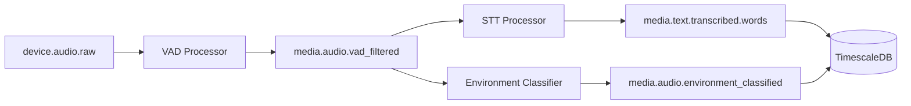
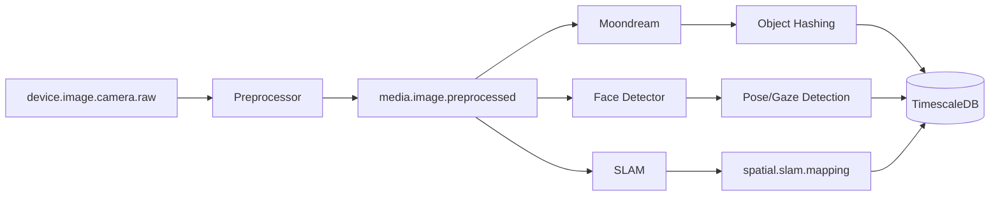

# Loom v2 Data Processing Flows

## Overview

Loom v2 implements 11 major data processing pipelines that transform raw sensor data, media, and external sources into structured, searchable, and actionable information. Each pipeline follows a consistent pattern: ingestion → processing → enrichment → persistence.

## Architecture Decisions

### Hybrid Configuration Approach

We use a hybrid approach that combines:
1. **Runtime flexibility**: Services read `INPUT_TOPICS` and `OUTPUT_TOPICS` from Docker environment variables
2. **Documentation completeness**: Detailed flow definitions in `docs/flows/` for validation and visualization
3. **Type safety**: JSON schemas for all data transformations

### Key Architectural Patterns

1. **Microservice per Processing Stage**: Each AI model or processing step runs in its own container
2. **Kafka as the Nervous System**: All data flows through Kafka topics with defined schemas
3. **TimescaleDB for Time-Series Data**: Optimized storage with automatic compression and retention
4. **Structured AI Outputs**: Using `outlines` library to ensure LLM outputs match schemas

## Processing Flow Summary

### Real-Time Flows (Critical Priority)

#### 1. Audio Processing Pipeline

- **Volume**: 10 events/sec, 32KB each
- **Latency**: VAD < 0.5s, STT < 3s
- **Models**: Silero VAD, NVIDIA Parakeet-TDT

#### 2. Camera Vision Pipeline

- **Volume**: 0.03 events/sec, 3MB each
- **Features**: Object detection, 3D hashing, face/pose/gaze tracking, SLAM
- **Models**: Moondream, MediaPipe, ORB-SLAM3

### High-Priority Flows

#### 3. Screenshot OCR Pipeline
- **Flow**: Screenshot → Preprocessing → OCR → Text Cleaning → Database
- **Volume**: 0.1 events/sec, 2MB each
- **Output**: Searchable text with layout information

#### 4. Location Enrichment Pipeline
- **Flow**: GPS → Georegion Detection → Geocoding → Business Identification → Database
- **Volume**: 0.1 events/sec
- **Features**: Real-time georegion detection, address lookup, business matching, location categorization
- **Database Access**: Services read from saved_georegions table and historical location data

#### 5. App Lifecycle Monitoring
- **Flow**: OS Events → Enrichment → Database
- **Volume**: 2 events/sec
- **Features**: App categorization, session tracking, usage patterns

### Medium-Priority Flows

#### 6. Motion Classification Pipeline
- **Flow**: Accelerometer → Windowing → Motion Detection → Activity Classification → Database
- **Volume**: 50 events/sec (highest volume)
- **Activities**: Still, walking, running, cycling, driving, transit

#### 7. Email Processing Pipeline
- **Flow**: IMAP Fetch → Parsing → Text Embedding → Database
- **Volume**: 0.01 events/sec
- **Features**: Thread detection, attachment handling, semantic search

#### 8. Calendar Processing Pipeline
- **Flow**: CalDAV Fetch → Enrichment → Text Embedding → Database
- **Volume**: 0.001 events/sec
- **Features**: Meeting type classification, temporal context

#### 9. Power State Monitoring
- **Flow**: Battery Events → Enrichment → Pattern Detection → Database
- **Volume**: 0.1 events/sec
- **Patterns**: Charging locations, usage patterns, battery health

### Low-Priority Flows

#### 10. Hacker News Processing
- **Flow**: API/Scrape → Content Fetch → Text Embedding → Database
- **Volume**: 0.0001 events/sec
- **Features**: Full article extraction, comment threads

#### 11. Network Event Processing
- **Flow**: WiFi Events → Enrichment → Location Correlation → Database
- **Volume**: 0.01 events/sec
- **Features**: Network categorization, location mapping

## New Kafka Topics

Based on the 11 flows, these topics need to be added:

### Processing Topics
```yaml
# Audio processing
media.audio.environment_classified

# Location processing  
location.georegion.detected
location.address.geocoded
location.business.identified

# Motion processing
device.sensor.accelerometer.windowed
motion.events.significant
motion.classification.activity

# Vision processing
media.image.camera.preprocessed
media.image.screenshot.preprocessed
media.image.objects_detected
media.image.objects_hashed
media.image.faces_detected
media.image.pose_detected
media.image.gaze_detected
media.text.ocr_extracted
media.text.ocr_cleaned
spatial.slam.mapping

# External data
external.email.raw
external.email.parsed
external.email.embedded
external.calendar.raw
external.calendar.enriched
external.calendar.embedded
external.hackernews.liked
external.hackernews.content_fetched
external.hackernews.embedded

# Enriched data
device.state.power.enriched
device.state.power.patterns
device.network.wifi.enriched
device.network.location_correlated
os.events.app_lifecycle.enriched

# Error topics
processing.errors.vad
processing.errors.stt
processing.errors.audio_classifier
processing.errors.georegion
processing.errors.geocoding
processing.errors.business_match
processing.errors.app_lifecycle
processing.errors.accelerometer
processing.errors.activity_classification
processing.errors.image_preprocessing
processing.errors.ocr
processing.errors.email_fetch
processing.errors.embedding
processing.errors.calendar_fetch
processing.errors.hn_scrape
processing.errors.vision_preprocessing
processing.errors.object_detection
processing.errors.face_detection
```

## Database Schema Requirements

### TimescaleDB Hypertables

Each flow requires specific hypertables with time-series optimization:

```sql
-- Audio data
CREATE TABLE transcripts (
    time TIMESTAMPTZ NOT NULL,
    device_id UUID,
    text TEXT,
    confidence FLOAT,
    speaker_id INT,
    PRIMARY KEY (time, device_id)
);
SELECT create_hypertable('transcripts', 'time');

-- Vision data
CREATE TABLE detected_objects (
    time TIMESTAMPTZ NOT NULL,
    device_id UUID,
    object_class TEXT,
    confidence FLOAT,
    bbox JSONB,
    perceptual_hash TEXT,
    PRIMARY KEY (time, device_id, object_class)
);
SELECT create_hypertable('detected_objects', 'time');

-- Motion data (high volume, short retention)
CREATE TABLE accelerometer_raw (
    time TIMESTAMPTZ NOT NULL,
    device_id UUID,
    x FLOAT, y FLOAT, z FLOAT,
    PRIMARY KEY (time, device_id)
);
SELECT create_hypertable('accelerometer_raw', 'time', 
    chunk_time_interval => INTERVAL '1 hour');
ALTER TABLE accelerometer_raw SET (
    timescaledb.compress,
    timescaledb.compress_after => INTERVAL '1 day'
);

-- Georegion definitions (not a hypertable, regular table)
CREATE TABLE saved_georegions (
    id UUID PRIMARY KEY DEFAULT gen_random_uuid(),
    name TEXT NOT NULL,
    region_type TEXT NOT NULL, -- 'home', 'work', 'custom'
    geom GEOMETRY(Polygon, 4326) NOT NULL,
    active BOOLEAN DEFAULT true,
    created_at TIMESTAMPTZ DEFAULT NOW(),
    updated_at TIMESTAMPTZ DEFAULT NOW()
);
CREATE INDEX idx_saved_georegions_geom ON saved_georegions USING GIST(geom);

-- Georegion presence (high volume time series)
CREATE TABLE georegion_presence (
    time TIMESTAMPTZ NOT NULL,
    device_id UUID NOT NULL,
    georegion_id UUID NOT NULL REFERENCES saved_georegions(id),
    georegion_name TEXT NOT NULL,
    event_type TEXT NOT NULL, -- 'enter', 'exit', 'present'
    latitude DOUBLE PRECISION,
    longitude DOUBLE PRECISION,
    PRIMARY KEY (time, device_id, georegion_id)
);
SELECT create_hypertable('georegion_presence', 'time',
    chunk_time_interval => INTERVAL '1 hour');
ALTER TABLE georegion_presence SET (
    timescaledb.compress,
    timescaledb.compress_after => INTERVAL '6 hours'
);

-- Location history for context queries
CREATE TABLE geocoded_locations (
    time TIMESTAMPTZ NOT NULL,
    device_id UUID NOT NULL,
    latitude DOUBLE PRECISION NOT NULL,
    longitude DOUBLE PRECISION NOT NULL,
    accuracy FLOAT,
    address TEXT,
    city TEXT,
    country TEXT,
    PRIMARY KEY (time, device_id)
);
SELECT create_hypertable('geocoded_locations', 'time');

-- Business visits
CREATE TABLE identified_businesses (
    time TIMESTAMPTZ NOT NULL,
    device_id UUID NOT NULL,
    business_id TEXT NOT NULL,
    name TEXT NOT NULL,
    category TEXT,
    confidence FLOAT,
    latitude DOUBLE PRECISION,
    longitude DOUBLE PRECISION,
    PRIMARY KEY (time, device_id, business_id)
);
SELECT create_hypertable('identified_businesses', 'time');
```

### Retention Policies

```sql
-- High-volume, low-value data: 7 days
SELECT add_retention_policy('accelerometer_raw', INTERVAL '7 days');

-- Medium-volume location data: 30 days
SELECT add_retention_policy('georegion_presence', INTERVAL '30 days');

-- Medium-value data: 30 days  
SELECT add_retention_policy('app_lifecycle_events', INTERVAL '30 days');
SELECT add_retention_policy('power_states', INTERVAL '30 days');

-- High-value location data: 90 days
SELECT add_retention_policy('geocoded_locations', INTERVAL '90 days');

-- High-value data: 90 days
SELECT add_retention_policy('transcripts', INTERVAL '90 days');
SELECT add_retention_policy('detected_objects', INTERVAL '90 days');

-- Business visits: 1 year
SELECT add_retention_policy('identified_businesses', INTERVAL '365 days');
```

## Implementation Roadmap

### Phase 1: Core Infrastructure (Current)
- ✅ Kafka topic creation
- ✅ TimescaleDB setup
- ⏳ Base microservice template

### Phase 2: Critical Flows (Sprint 6)
- [ ] Audio processing (VAD + STT)
- [ ] Screenshot OCR
- [ ] App lifecycle monitoring

### Phase 3: Vision & ML (Sprint 7)
- [ ] Camera vision pipeline
- [ ] Motion classification
- [ ] Location enrichment

### Phase 4: External Integration (Sprint 8)
- [ ] Email processing
- [ ] Calendar sync
- [ ] Hacker News scraper

### Phase 5: Advanced Analytics (Sprint 9)
- [ ] Pattern detection across all flows
- [ ] Cross-flow correlation
- [ ] Real-time dashboards

## Monitoring Strategy

### Service Health
- All services expose `/healthz` and `/readyz`
- Prometheus metrics for latency, throughput, errors
- Grafana dashboards per flow

### Data Quality
- Schema validation at every stage
- Data completeness tracking
- Anomaly detection on volumes

### Performance Targets
- Audio: < 3s end-to-end latency
- Vision: < 10s for full pipeline
- Motion: < 1s for classification
- External: < 5min sync delay

## Development Guidelines

### Adding a New Flow
1. Define the flow in `docs/flows/[name].yaml`
2. Create Kafka topics with proper retention
3. Implement services following the template
4. Add monitoring and alerting
5. Document in this file

### Service Template
Each processing service should:
```python
# Standard structure
class ProcessorService:
    def __init__(self):
        self.input_topics = os.getenv('INPUT_TOPICS').split(',')
        self.output_topics = os.getenv('OUTPUT_TOPICS').split(',')
        self.consumer = KafkaConsumer(...)
        self.producer = KafkaProducer(...)
        # Optional: Database connection for context
        self.db_pool = asyncpg.create_pool(os.getenv('DATABASE_URL'))
    
    async def process(self, message):
        # Validate input schema
        # Optional: Query database for context
        # Process data
        # Validate output schema
        # Send to output topics
        # Update metrics
```

### Database Access Patterns

Services can access the database for enrichment and context:

```python
# Example: Georegion Detector Service
class GeoregionDetector:
    async def load_georegions(self):
        """Cache georegions from database"""
        async with self.db_pool.acquire() as conn:
            regions = await conn.fetch("""
                SELECT id, name, region_type, ST_AsGeoJSON(geom) as geom
                FROM saved_georegions WHERE active = true
            """)
            return self._index_regions(regions)
    
    async def check_point_in_regions(self, lat, lon):
        """Check if point is in any georegion"""
        async with self.db_pool.acquire() as conn:
            regions = await conn.fetch("""
                SELECT id, name FROM saved_georegions 
                WHERE ST_Contains(geom, ST_SetSRID(ST_MakePoint($1, $2), 4326))
                AND active = true
            """, lon, lat)
            return regions

# Example: Business Matcher Service
class BusinessMatcher:
    async def get_last_business(self, device_id):
        """Get last visited business for context"""
        async with self.db_pool.acquire() as conn:
            return await conn.fetchrow("""
                SELECT business_id, name, category, time
                FROM identified_businesses
                WHERE device_id = $1
                ORDER BY time DESC LIMIT 1
            """, device_id)
    
    async def get_visit_frequency(self, device_id):
        """Get frequently visited businesses"""
        async with self.db_pool.acquire() as conn:
            return await conn.fetch("""
                SELECT business_id, name, COUNT(*) as visits
                FROM identified_businesses
                WHERE device_id = $1 
                AND time > NOW() - INTERVAL '30 days'
                GROUP BY business_id, name
                ORDER BY visits DESC
                LIMIT 10
            """, device_id)
```

## Security Considerations

- All external data fetching happens in isolated containers
- Credentials stored in Kubernetes secrets
- Data encryption in transit (Kafka SSL)
- PII detection and masking in text pipelines
- Face anonymization option in vision pipeline

## Cost Optimization

### Storage
- Aggressive compression for time-series data
- Retention policies based on data value
- Downsampling for long-term storage

### Compute
- CPU services for simple transformations
- GPU services only for ML models
- Horizontal scaling for stateless processors
- Batch processing for non-real-time flows