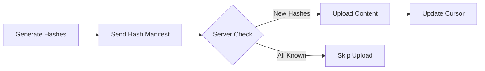

# Loom v2 Deduplication Strategy

## Overview

This document defines the universal deduplication strategy for Loom v2, enabling efficient synchronization of historical data without uploading duplicates. The system uses client-side hashing with a hash-first protocol to minimize bandwidth usage and ensure data consistency across all platforms.

## Core Principles

1. **Client-Side Hashing**: All content is hashed on the client before upload
2. **Immutable Fields**: Use only fields that won't change with OS/API updates
3. **Consistent Normalization**: Apply the same normalization rules across all platforms
4. **Version-Aware**: Hash algorithms are versioned to support future updates
5. **Graceful Fallbacks**: Multiple strategies for missing fields

## Architecture

### Client Flow


### Server Components
- **Deduplication Service**: Manages hash checking and storage
- **Hash Storage**: TimescaleDB table with efficient indexing
- **Manifest API**: Batch hash checking endpoint
- **Statistics**: Track deduplication effectiveness

## Universal Normalization Rules

### Text Normalization
```python
def normalize_text(text: str) -> str:
    """Normalize text for consistent hashing"""
    # Preserve content but normalize whitespace
    text = " ".join(text.split())  # Collapse multiple spaces
    text = text.strip()             # Remove leading/trailing whitespace
    # Do NOT lowercase - preserves information
    return text
```

### Phone Number Normalization
```python
def normalize_phone(phone: str) -> str:
    """Convert to E.164 format"""
    # Remove all non-digits
    digits = re.sub(r'\D', '', phone)

    # Handle country codes (example for US)
    if len(digits) == 10:
        return f"+1{digits}"
    elif len(digits) == 11 and digits[0] == '1':
        return f"+{digits}"
    else:
        # Keep as-is if format unclear
        return f"+{digits}"
```

### Timestamp Normalization
```python
def normalize_timestamp(ts: Any) -> int:
    """Convert any timestamp to Unix milliseconds (UTC)"""
    if isinstance(ts, int):
        # Assume Unix timestamp
        if ts < 10000000000:  # Seconds
            return ts * 1000
        return ts  # Already milliseconds
    elif isinstance(ts, str):
        # Parse ISO format
        dt = datetime.fromisoformat(ts.replace('Z', '+00:00'))
        return int(dt.timestamp() * 1000)
    elif isinstance(ts, datetime):
        return int(ts.timestamp() * 1000)
```

### ID Normalization
```python
def normalize_id(id_value: str) -> str:
    """Normalize IDs while preserving structure"""
    # Keep alphanumeric + common ID chars
    # Preserve: letters, numbers, dash, underscore, colon
    return re.sub(r'[^a-zA-Z0-9\-_:]', '', id_value)
```

## Data Type Specifications

### SMS Messages
```python
def generate_sms_hash(sms: SMSMessage) -> str:
    """Generate hash for SMS message"""
    # Required fields
    phone = normalize_phone(sms.address or sms.sender)
    timestamp = normalize_timestamp(sms.date or sms.timestamp)
    body = normalize_text(sms.body)

    # Optional fields for secondary validation
    thread_id = str(sms.thread_id) if hasattr(sms, 'thread_id') else ""

    # Build hash content
    content = f"sms:v1:{phone}:{timestamp}:{body}:{thread_id}"
    return sha256(content.encode('utf-8')).hexdigest()
```

**Fields Used**:
- `phone`: Sender/recipient phone number (normalized to E.164)
- `timestamp`: Message timestamp (Unix milliseconds)
- `body`: Message content (whitespace normalized)
- `thread_id`: Conversation thread (optional, for validation)

### MMS Messages
```python
def generate_mms_hash(mms: MMSMessage) -> str:
    """Generate hash for MMS message"""
    # Start with SMS hash components
    phone = normalize_phone(mms.address or mms.sender)
    timestamp = normalize_timestamp(mms.date or mms.timestamp)
    body = normalize_text(mms.body or "")

    # Add MMS-specific components
    media_count = len(mms.attachments) if hasattr(mms, 'attachments') else 0
    media_sizes = sum(a.size for a in mms.attachments) if media_count > 0 else 0

    content = f"mms:v1:{phone}:{timestamp}:{body}:{media_count}:{media_sizes}"
    return sha256(content.encode('utf-8')).hexdigest()
```

### Email Messages
```python
def generate_email_hash(email: EmailMessage) -> str:
    """Generate hash for email with fallback strategies"""
    # Strategy 1: Use Message-ID (most reliable)
    if hasattr(email, 'message_id') and email.message_id:
        message_id = normalize_id(email.message_id)
        content = f"email:v1:msgid:{message_id}"
        return sha256(content.encode('utf-8')).hexdigest()

    # Strategy 2: Use immutable headers
    from_addr = email.from_address.lower().strip()
    subject = normalize_text(email.subject)
    date_unix = normalize_timestamp(email.date)

    # Include recipient for uniqueness
    to_addr = email.to_address[0].lower().strip() if email.to_address else ""

    content = f"email:v1:headers:{from_addr}:{to_addr}:{date_unix}:{subject}"
    return sha256(content.encode('utf-8')).hexdigest()
```

### Calendar Events
```python
def generate_calendar_hash(event: CalendarEvent) -> str:
    """Generate hash for calendar events"""
    # Strategy 1: Use iCalendar UID (RFC 5545)
    if hasattr(event, 'uid') and event.uid:
        uid = normalize_id(event.uid)
        content = f"cal:v1:uid:{uid}"
        return sha256(content.encode('utf-8')).hexdigest()

    # Strategy 2: Use event properties
    start_time = normalize_timestamp(event.start_time)
    end_time = normalize_timestamp(event.end_time)
    title = normalize_text(event.title)
    location = normalize_text(event.location or "")

    # Include organizer for uniqueness
    organizer = event.organizer.lower().strip() if hasattr(event, 'organizer') else ""

    content = f"cal:v1:event:{start_time}:{end_time}:{title}:{location}:{organizer}"
    return sha256(content.encode('utf-8')).hexdigest()
```

### Photos/Images
```python
def generate_photo_hash(photo: PhotoData) -> str:
    """Generate hash for photos - content-based is most reliable"""
    # Always use content-based hashing for reliability
    # EXIF can be missing (screenshots, downloads, edited photos)

    # For small images (<10MB), hash entire content
    if len(photo.data) < 10 * 1024 * 1024:
        content_hash = sha256(photo.data).hexdigest()
        return f"photo:v1:full:{content_hash}"

    # For larger images, use sampling strategy
    # Hash: first 1MB + middle 1MB + last 1MB + file size
    sample_size = 1024 * 1024  # 1MB
    file_size = len(photo.data)

    first_chunk = photo.data[:sample_size]
    middle_start = (file_size // 2) - (sample_size // 2)
    middle_chunk = photo.data[middle_start:middle_start + sample_size]
    last_chunk = photo.data[-sample_size:]

    hasher = sha256()
    hasher.update(b"photo:v1:sample:")
    hasher.update(first_chunk)
    hasher.update(middle_chunk)
    hasher.update(last_chunk)
    hasher.update(str(file_size).encode('utf-8'))

    return hasher.hexdigest()
```

### App Usage Events
```python
def generate_app_usage_hash(event: AppUsageEvent) -> str:
    """Generate hash for app usage events"""
    # Use stable identifiers
    package_name = event.package_name or event.app_id
    event_type = event.event_type  # 'opened', 'closed', 'foreground', etc.
    timestamp = normalize_timestamp(event.timestamp)

    # Include duration for session events
    duration = event.duration_ms if hasattr(event, 'duration_ms') else 0

    content = f"appusage:v1:{package_name}:{event_type}:{timestamp}:{duration}"
    return sha256(content.encode('utf-8')).hexdigest()
```

### Notes on ID Consistency

**Reliable IDs**:
- **Email Message-ID**: RFC 5322 compliant, globally unique, never changes
- **Calendar UID**: RFC 5545 standard, persistent (but not always present)
- **Tweet/X IDs**: Globally unique, permanent
- **File paths**: Stable within a device (but can be moved)

**Unreliable IDs**:
- **SMS/MMS**: No standard unique ID across platforms
- **Android `_id`**: Local database ID, changes on reinstall
- **Thread IDs**: Device-local, unstable
- **Device IDs**: Can change with factory resets or OS updates

### Additional Data Types

#### Browser History
```python
def generate_browser_history_hash(entry: BrowserHistoryEntry) -> str:
    """Generate hash for browser history entries"""
    url = normalize_url(entry.url)  # Remove fragments, normalize encoding
    visit_time = normalize_timestamp(entry.visit_time)
    # Title excluded as it can change dynamically

    content = f"browser:v1:{url}:{visit_time}"
    return sha256(content.encode('utf-8')).hexdigest()

def normalize_url(url: str) -> str:
    """Normalize URL for consistent hashing"""
    from urllib.parse import urlparse, urlunparse
    parsed = urlparse(url.lower())
    # Remove fragment, normalize host
    normalized = urlunparse((
        parsed.scheme,
        parsed.netloc,
        parsed.path.rstrip('/'),
        parsed.params,
        parsed.query,
        ''  # Remove fragment
    ))
    return normalized
```

**Fields Used**:
- `url`: Full URL (normalized, fragment removed)
- `visit_time`: Visit timestamp (Unix milliseconds)

#### Clipboard Entries
```python
def generate_clipboard_hash(entry: ClipboardEntry) -> str:
    """Generate hash for clipboard content"""
    timestamp = normalize_timestamp(entry.timestamp)
    content_type = entry.content_type  # text, image, file, url

    if content_type == "text":
        # For text, use normalized content
        normalized_content = normalize_text(entry.content_text)
        content_hash = sha256(normalized_content.encode('utf-8')).hexdigest()
    else:
        # For binary content, hash raw data
        content_hash = sha256(entry.content_data).hexdigest()

    # Include first 16 chars of content hash for quick comparison
    content = f"clipboard:v1:{timestamp}:{content_type}:{content_hash[:16]}"
    return sha256(content.encode('utf-8')).hexdigest()
```

**Fields Used**:
- `timestamp`: When copied (Unix milliseconds)
- `content_type`: Type of clipboard content
- `content_hash`: SHA-256 of normalized content (first 16 chars)

#### WiFi Networks
```python
def generate_wifi_hash(network: WiFiNetwork) -> str:
    """Generate hash for WiFi network observations"""
    bssid = normalize_mac(network.bssid)  # Normalize MAC format
    timestamp = normalize_timestamp(network.timestamp)
    ssid = normalize_text(network.ssid)

    # Include connection state for context
    is_connected = "1" if network.is_connected else "0"

    content = f"wifi:v1:{bssid}:{ssid}:{timestamp}:{is_connected}"
    return sha256(content.encode('utf-8')).hexdigest()

def normalize_mac(mac: str) -> str:
    """Normalize MAC address format"""
    # Remove all separators and uppercase
    mac_clean = re.sub(r'[:\-\.]', '', mac).upper()
    # Format as XX:XX:XX:XX:XX:XX
    return ':'.join(mac_clean[i:i+2] for i in range(0, 12, 2))
```

**Fields Used**:
- `bssid`: Access point MAC address (normalized)
- `ssid`: Network name
- `timestamp`: Observation time (Unix milliseconds)
- `is_connected`: Connection state

#### Location Points
```python
def generate_location_hash(location: LocationPoint) -> str:
    """Generate hash for GPS location points"""
    # Round to ~11m precision to handle GPS drift
    lat = round(location.latitude, 4)
    lon = round(location.longitude, 4)
    timestamp = normalize_timestamp(location.timestamp)

    # Include accuracy for filtering
    accuracy = round(location.accuracy, 0) if location.accuracy else 0

    content = f"location:v1:{lat}:{lon}:{timestamp}:{accuracy}"
    return sha256(content.encode('utf-8')).hexdigest()
```

**Fields Used**:
- `latitude`: Rounded to 4 decimals (~11m precision)
- `longitude`: Rounded to 4 decimals
- `timestamp`: Measurement time (Unix milliseconds)
- `accuracy`: GPS accuracy in meters

#### Bluetooth Devices
```python
def generate_bluetooth_hash(device: BluetoothDevice) -> str:
    """Generate hash for Bluetooth device observations"""
    mac = normalize_mac(device.bluetooth_mac)
    timestamp = normalize_timestamp(device.timestamp)

    # Include connection state
    is_connected = "1" if device.is_connected else "0"
    is_paired = "1" if device.is_paired else "0"

    content = f"bluetooth:v1:{mac}:{timestamp}:{is_connected}:{is_paired}"
    return sha256(content.encode('utf-8')).hexdigest()
```

**Fields Used**:
- `bluetooth_mac`: Device MAC address (normalized)
- `timestamp`: Observation time (Unix milliseconds)
- `is_connected`: Connection state
- `is_paired`: Pairing state

#### System Notifications
```python
def generate_notification_hash(notification: SystemNotification) -> str:
    """Generate hash for system notifications"""
    timestamp = normalize_timestamp(notification.timestamp)
    app_id = normalize_id(notification.app_identifier)

    # Normalize notification content
    title = normalize_text(notification.title or "")
    body = normalize_text(notification.body or "")

    # Use notification ID if available, otherwise hash content
    if notification.notification_id:
        notif_id = normalize_id(notification.notification_id)
        content = f"notification:v1:{app_id}:{notif_id}:{timestamp}"
    else:
        # Fallback for systems without notification IDs
        content_hash = sha256(f"{title}:{body}".encode('utf-8')).hexdigest()[:16]
        content = f"notification:v1:{app_id}:{timestamp}:{content_hash}"

    return sha256(content.encode('utf-8')).hexdigest()
```

**Fields Used**:
- `app_identifier`: Source app ID
- `notification_id`: System notification ID (if available)
- `timestamp`: Notification time (Unix milliseconds)
- Content hash fallback for missing IDs

#### Sensor Readings
```python
def generate_sensor_hash(reading: SensorReading) -> str:
    """Generate hash for various sensor readings"""
    timestamp = normalize_timestamp(reading.timestamp)
    sensor_type = reading.sensor_type  # accelerometer, gyroscope, etc.

    # Round sensor values to reasonable precision
    if sensor_type in ['accelerometer', 'gyroscope', 'magnetometer']:
        # 3-axis sensors
        x = round(reading.x, 3)
        y = round(reading.y, 3)
        z = round(reading.z, 3)
        content = f"sensor:v1:{sensor_type}:{timestamp}:{x}:{y}:{z}"
    elif sensor_type in ['temperature', 'pressure', 'light']:
        # Single value sensors
        value = round(reading.value, 2)
        content = f"sensor:v1:{sensor_type}:{timestamp}:{value}"
    else:
        # Generic sensor
        value_hash = sha256(str(reading.value).encode('utf-8')).hexdigest()[:16]
        content = f"sensor:v1:{sensor_type}:{timestamp}:{value_hash}"

    return sha256(content.encode('utf-8')).hexdigest()
```

**Fields Used**:
- `sensor_type`: Type of sensor
- `timestamp`: Reading time (Unix milliseconds)
- Sensor values rounded to appropriate precision

#### Network Statistics
```python
def generate_network_stats_hash(stats: NetworkStats) -> str:
    """Generate hash for network interface statistics"""
    timestamp = normalize_timestamp(stats.timestamp)
    interface = stats.interface_name

    # Use cumulative counters which only increase
    bytes_sent = stats.bytes_sent
    bytes_received = stats.bytes_received

    content = f"netstats:v1:{interface}:{timestamp}:{bytes_sent}:{bytes_received}"
    return sha256(content.encode('utf-8')).hexdigest()
```

**Fields Used**:
- `interface_name`: Network interface
- `timestamp`: Measurement time (Unix milliseconds)
- `bytes_sent`: Cumulative bytes sent
- `bytes_received`: Cumulative bytes received

#### Power State
```python
def generate_power_state_hash(power: PowerState) -> str:
    """Generate hash for device power state"""
    timestamp = normalize_timestamp(power.timestamp)
    battery_level = power.battery_level  # 0-100

    # Charging states as flags
    is_charging = "1" if power.is_charging else "0"
    is_plugged = "1" if power.is_plugged_in else "0"

    content = f"power:v1:{timestamp}:{battery_level}:{is_charging}:{is_plugged}"
    return sha256(content.encode('utf-8')).hexdigest()
```

**Fields Used**:
- `timestamp`: Measurement time (Unix milliseconds)
- `battery_level`: Battery percentage (0-100)
- `is_charging`: Charging state
- `is_plugged_in`: Power connection state

#### App Lifecycle Events
```python
def generate_app_lifecycle_hash(event: AppLifecycleEvent) -> str:
    """Generate hash for app lifecycle events"""
    timestamp = normalize_timestamp(event.timestamp)
    app_id = normalize_id(event.app_identifier)
    event_type = event.event_type  # launch, foreground, background, terminate

    # Include duration for session events
    duration = event.duration_seconds if hasattr(event, 'duration_seconds') else 0

    content = f"app_lifecycle:v1:{app_id}:{event_type}:{timestamp}:{duration}"
    return sha256(content.encode('utf-8')).hexdigest()
```

**Fields Used**:
- `app_identifier`: App bundle ID or package name
- `event_type`: Lifecycle event type
- `timestamp`: Event time (Unix milliseconds)
- `duration_seconds`: Session duration (if applicable)

#### Health Metrics
```python
def generate_health_metric_hash(metric: HealthMetric) -> str:
    """Generate hash for health measurements"""
    timestamp = normalize_timestamp(metric.timestamp)
    metric_type = metric.type  # heartrate, steps, etc.

    if metric_type == "heartrate":
        value = metric.heart_rate
        confidence = round(metric.confidence, 2) if hasattr(metric, 'confidence') else 0
        content = f"health:v1:{metric_type}:{timestamp}:{value}:{confidence}"
    elif metric_type == "steps":
        count = metric.step_count
        duration = metric.duration_seconds if hasattr(metric, 'duration_seconds') else 0
        content = f"health:v1:{metric_type}:{timestamp}:{count}:{duration}"
    else:
        # Generic health metric
        value_str = str(metric.value)
        content = f"health:v1:{metric_type}:{timestamp}:{value_str}"

    return sha256(content.encode('utf-8')).hexdigest()
```

**Fields Used**:
- `type`: Type of health metric
- `timestamp`: Measurement time (Unix milliseconds)
- Metric-specific values with appropriate precision

#### Motion Sensors
```python
def generate_motion_hash(motion: MotionData) -> str:
    """Generate hash for device motion data"""
    timestamp = normalize_timestamp(motion.timestamp)

    # Accelerometer data (m/s²)
    acc_x = round(motion.accel_x, 3)
    acc_y = round(motion.accel_y, 3)
    acc_z = round(motion.accel_z, 3)

    # Gyroscope data (rad/s) if available
    if hasattr(motion, 'gyro_x'):
        gyro_x = round(motion.gyro_x, 3)
        gyro_y = round(motion.gyro_y, 3)
        gyro_z = round(motion.gyro_z, 3)
        content = f"motion:v1:{timestamp}:{acc_x}:{acc_y}:{acc_z}:{gyro_x}:{gyro_y}:{gyro_z}"
    else:
        content = f"motion:v1:{timestamp}:{acc_x}:{acc_y}:{acc_z}"

    return sha256(content.encode('utf-8')).hexdigest()
```

**Fields Used**:
- `timestamp`: Measurement time (Unix milliseconds)
- Accelerometer values (x, y, z) rounded to 3 decimals
- Gyroscope values (x, y, z) if available

## Client-Server Protocol

### 1. Check Hash Manifest
**Endpoint**: `POST /api/v1/dedup/check-manifest`

**Request**:
```json
{
  "items": [
    {
      "hash": "sha256_hash_here",
      "type": "sms",
      "timestamp": 1704067200000,
      "size": 1024  // Optional, for bandwidth planning
    }
  ],
  "device_id": "device-uuid",
  "cursor": "previous-sync-cursor"  // Optional
}
```

**Response**:
```json
{
  "needed_hashes": ["hash1", "hash2"],
  "already_exists": ["hash3", "hash4"],
  "stats": {
    "total_checked": 4,
    "new_items": 2,
    "duplicates": 2,
    "dedup_rate": 0.5
  },
  "cursor": "new-cursor-for-next-sync"
}
```

### 2. Upload with Manifest
**Endpoint**: `POST /api/v1/{data_type}/upload-with-manifest`

**Request**:
```json
{
  "manifest": [
    {
      "hash": "sha256_hash",
      "timestamp": 1704067200000
    }
  ],
  "items": [
    {
      "hash": "sha256_hash",
      "content": { /* actual data */ }
    }
  ],
  "device_id": "device-uuid"
}
```

## Implementation Guidelines

### Client Libraries

#### TypeScript/JavaScript
```typescript
export class LoomDeduplicator {
  private readonly VERSION = "v1";

  generateSMSHash(sms: SMSMessage): string {
    const phone = this.normalizePhone(sms.address);
    const timestamp = this.normalizeTimestamp(sms.date);
    const body = this.normalizeText(sms.body);

    const content = `sms:${this.VERSION}:${phone}:${timestamp}:${body}`;
    return this.sha256(content);
  }

  private normalizePhone(phone: string): string {
    // Implementation following spec above
  }
}
```

#### Python
```python
class LoomDeduplicator:
    VERSION = "v1"

    def generate_sms_hash(self, sms: SMSMessage) -> str:
        phone = self.normalize_phone(sms.address)
        timestamp = self.normalize_timestamp(sms.date)
        body = self.normalize_text(sms.body)

        content = f"sms:{self.VERSION}:{phone}:{timestamp}:{body}"
        return hashlib.sha256(content.encode('utf-8')).hexdigest()
```

### Server Implementation

#### Database Schema
```sql
-- Main deduplication table
CREATE TABLE deduplication_hashes (
    hash VARCHAR(64) PRIMARY KEY,
    data_type VARCHAR(32) NOT NULL,
    source_device_id TEXT,
    original_timestamp BIGINT NOT NULL,
    first_seen_at TIMESTAMPTZ DEFAULT NOW(),
    last_seen_at TIMESTAMPTZ DEFAULT NOW(),
    submission_count INTEGER DEFAULT 1,
    metadata JSONB
);

-- Indexes for performance
CREATE INDEX idx_dedup_type_time ON deduplication_hashes(data_type, original_timestamp DESC);
CREATE INDEX idx_dedup_device ON deduplication_hashes(source_device_id, data_type);
CREATE INDEX idx_dedup_seen ON deduplication_hashes(last_seen_at);

-- Sync cursor tracking
CREATE TABLE dedup_sync_cursors (
    device_id TEXT NOT NULL,
    data_type VARCHAR(32) NOT NULL,
    cursor_value TEXT NOT NULL,
    updated_at TIMESTAMPTZ DEFAULT NOW(),
    PRIMARY KEY (device_id, data_type)
);
```

#### FastAPI Endpoint
```python
@router.post("/api/v1/dedup/check-manifest")
async def check_manifest(request: ManifestCheckRequest) -> ManifestCheckResponse:
    """Check which hashes need to be uploaded"""

    # Extract all hashes from request
    requested_hashes = [item.hash for item in request.items]

    # Check which exist in database
    existing = await db.fetch_existing_hashes(requested_hashes)
    existing_set = set(existing)

    # Determine which are needed
    needed = [h for h in requested_hashes if h not in existing_set]

    # Update last_seen for existing hashes
    if existing:
        await db.update_last_seen(existing)

    # Calculate stats
    total = len(requested_hashes)
    new_count = len(needed)

    return ManifestCheckResponse(
        needed_hashes=needed,
        already_exists=list(existing_set),
        stats={
            "total_checked": total,
            "new_items": new_count,
            "duplicates": total - new_count,
            "dedup_rate": (total - new_count) / total if total > 0 else 0
        },
        cursor=generate_cursor(request.device_id, request.items)
    )
```

## Testing

### Test Vectors
Each implementation MUST pass these test vectors to ensure consistency:

```json
{
  "sms_test": {
    "input": {
      "address": "+1 (555) 123-4567",
      "date": "2024-01-01T00:00:00Z",
      "body": "Hello   World!  ",
      "thread_id": 42
    },
    "expected_hash": "a1b2c3d4..."  // To be calculated
  },
  "email_test": {
    "input": {
      "message_id": "<123456@example.com>",
      "from_address": "sender@example.com",
      "subject": "Test  Email"
    },
    "expected_hash": "e5f6a7b8..."  // To be calculated
  }
}
```

### Validation Script
```python
def validate_implementation(deduplicator: LoomDeduplicator):
    """Validate deduplication implementation against test vectors"""
    with open('test_vectors.json') as f:
        vectors = json.load(f)

    for test_name, test_data in vectors.items():
        result = deduplicator.generate_hash(test_data['input'])
        assert result == test_data['expected_hash'], f"Failed {test_name}"
```

## Migration Strategy

### Version Migration
When updating hash algorithms:

1. Increment version number in hash prefix
2. Support both versions during transition
3. Gradually migrate old hashes:
   ```sql
   -- Add version column
   ALTER TABLE deduplication_hashes ADD COLUMN hash_version VARCHAR(8) DEFAULT 'v1';

   -- Track both old and new hashes during migration
   ```

### Rollout Plan
1. Deploy server support for new protocol
2. Update clients with backward compatibility
3. Monitor deduplication rates
4. Gradually phase out old protocol

## Monitoring

### Key Metrics
- **Deduplication Rate**: Percentage of uploads avoided
- **Hash Collisions**: Should be near zero
- **Upload Bandwidth Saved**: Calculate based on avoided uploads
- **Sync Performance**: Time to check manifests

### Dashboards
```sql
-- Daily deduplication stats
SELECT
    data_type,
    DATE(first_seen_at) as date,
    COUNT(*) as total_hashes,
    SUM(submission_count - 1) as duplicates_avoided,
    AVG(submission_count) as avg_submissions_per_item
FROM deduplication_hashes
GROUP BY data_type, DATE(first_seen_at)
ORDER BY date DESC;
```

## Security Considerations

1. **Hash Collisions**: Use SHA-256 for negligible collision probability
2. **Privacy**: Hashes don't reveal content but patterns could be analyzed
3. **Rate Limiting**: Implement per-device rate limits on manifest checks
4. **Authentication**: Require device authentication for all endpoints

## Future Enhancements

1. **Compression**: Use Bloom filters for client-side pre-filtering
2. **Batch Processing**: Pipeline manifest checks with uploads
3. **Edge Caching**: Cache manifest results at edge locations
4. **P2P Sync**: Allow devices to sync directly when on same network
