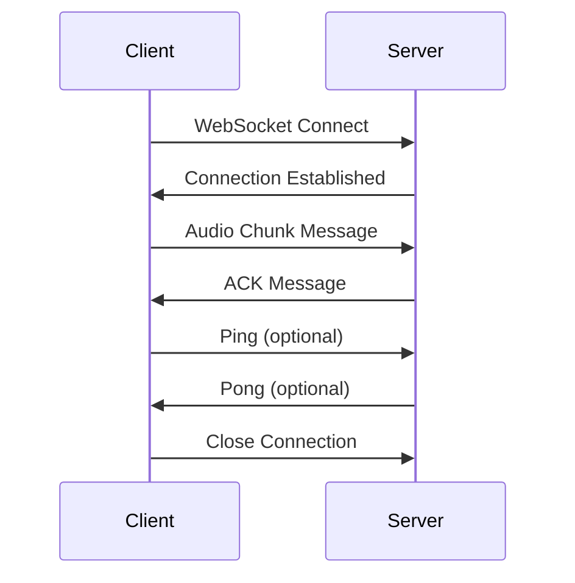

# Loom v2 Ingestion API - Integration Guide

> **Complete developer guide for integrating with the Loom v2 personal informatics data pipeline**

[](http://localhost:8000/docs)
[](https://fastapi.tiangolo.com)
[](https://tools.ietf.org/html/rfc6455)

## 📋 Table of Contents

- [Quick Start](#-quick-start)
- [Service Overview](#-service-overview)
- [Authentication](#-authentication)
- [Core API Endpoints](#-core-api-endpoints)
- [Data Models & Schemas](#-data-models--schemas)
- [WebSocket Streaming](#-websocket-streaming)
- [Error Handling](#-error-handling)
- [Rate Limiting & Performance](#-rate-limiting--performance)
- [Configuration](#-configuration)
- [SDK Examples](#-sdk-examples)
- [Testing](#-testing)
- [Production Deployment](#-production-deployment)

## 🚀 Quick Start

### Prerequisites
- Loom v2 service running on `http://localhost:8000`
- Valid device ID for your integration
- JSON-capable HTTP client

### Basic Health Check
```bash
curl http://localhost:8000/healthz
```

### Send Your First Data Point
```bash
# GPS Location
curl -X POST http://localhost:8000/sensor/gps \
  -H "Content-Type: application/json" \
  -d '{
    "device_id": "my-device-001",
    "latitude": 37.7749,
    "longitude": -122.4194,
    "accuracy": 5.0
  }'
```

### Explore Interactive Docs
Visit **http://localhost:8000/docs** for interactive API documentation with live testing capabilities.

## 🏗️ Service Overview

The Loom v2 Ingestion API is a high-performance FastAPI service that ingests real-time personal informatics data from various devices and streams it into Kafka topics for processing.

### Key Features
- **Real-time ingestion** via REST and WebSocket APIs
- **Schema validation** using JSON Schema Draft 2020-12
- **Multi-device support** with device-specific routing
- **Kafka streaming** for downstream processing
- **Prometheus metrics** for monitoring
- **Health checks** for Kubernetes deployment

### Architecture
```
Device/App → Ingestion API → Kafka Topics → Data Pipeline
```

**Base URL**: `http://localhost:8000` (development)
**Service Version**: v0.1.0
**OpenAPI Docs**: `/docs` and `/redoc`

## 🔐 Authentication

**Current Status**: No authentication required (development mode)

⚠️ **Production Note**: Authentication will be implemented before production deployment. Current CORS policy allows all origins (`*`).

## 📡 Core API Endpoints

### 🔍 Health & Monitoring

#### `GET /` - Service Information
Returns service metadata and available endpoints.

**Response**:
```json
{
  "service": "loom-ingestion-api",
  "version": "0.1.0",
  "description": "FastAPI service for ingesting device data into Kafka topics",
  "endpoints": {
    "health": "/healthz",
    "readiness": "/readyz",
    "audio_websocket": "/audio/stream/{device_id}",
    "audio_upload": "/audio/upload",
    "sensor_endpoints": "/sensor/*",
    "metrics": "/metrics",
    "docs": "/docs"
  }
}
```

#### `GET /healthz` - Liveness Probe
Kubernetes liveness probe endpoint.

**Response**:
```json
{
  "status": "healthy",
  "timestamp": "2024-01-01T00:00:00.000Z",
  "version": "0.1.0",
  "kafka_connected": true
}
```

**Status Codes**:
- `200`: Service is healthy
- `503`: Service is unhealthy

#### `GET /readyz` - Readiness Probe
Kubernetes readiness probe endpoint.

**Response**: Same as `/healthz`

**Status Codes**:
- `200`: Service is ready to accept traffic
- `503`: Service dependencies are unavailable

#### `GET /metrics` - Prometheus Metrics
Returns Prometheus-formatted application metrics.

**Content-Type**: `text/plain; version=0.0.4; charset=utf-8`

**Available Metrics**:
- `http_requests_total{method, endpoint, status_code}` - Total HTTP requests
- `http_request_duration_seconds{method, endpoint}` - Request duration histogram
- `kafka_messages_total{topic, status}` - Total Kafka messages sent
- `websocket_connections_total{device_id}` - Active WebSocket connections

### 🎵 Audio Data Endpoints

#### `POST /audio/upload` - Single Audio Chunk
Upload a single audio chunk for processing.

**Content-Type**: `application/json`

**Request Schema**:
```json
{
  "device_id": "string",           // Required: Unique device identifier
  "chunk_data": "string",          // Required: Base64-encoded audio data
  "sample_rate": 44100,            // Required: Audio sample rate (Hz)
  "channels": 1,                   // Required: Number of audio channels
  "format": "wav",                 // Required: Audio format (wav, mp3, flac)
  "duration_ms": 1000,             // Required: Chunk duration in milliseconds
  "file_id": "uuid",               // Optional: File ID for multi-chunk files
  "timestamp": "2024-01-01T00:00:00.000Z"  // Optional: Auto-generated if not provided
}
```

**Response**:
```json
{
  "status": "success",
  "message_id": "550e8400-e29b-41d4-a716-446655440000",
  "topic": "device.audio.raw",
  "timestamp": "2024-01-01T00:00:00.000Z"
}
```

**Target Kafka Topic**: `device.audio.raw`

**Validation Rules**:
- `chunk_data`: Must be valid base64
- `sample_rate`: Common rates (8000, 16000, 22050, 44100, 48000 Hz)
- `channels`: 1-8 channels supported
- `format`: Supported formats: wav, mp3, flac, aac
- `duration_ms`: 1-60000 ms (1 second to 1 minute)

**Example cURL**:
```bash
curl -X POST http://localhost:8000/audio/upload \
  -H "Content-Type: application/json" \
  -d '{
    "device_id": "microphone-001",
    "chunk_data": "UklGRiQAAABXQVZFZm10IBA...",
    "sample_rate": 44100,
    "channels": 2,
    "format": "wav",
    "duration_ms": 1000
  }'
```

#### `GET /audio/connections` - Active Connections
Returns information about active WebSocket audio connections.

**Response**:
```json
{
  "active_connections": 3,
  "connected_devices": [
    "microphone-001",
    "phone-audio-002",
    "headset-003"
  ],
  "total_messages_received": 15847,
  "uptime_seconds": 3600
}
```

### 🖥️ System Monitoring Endpoints

#### `POST /system/apps/macos` - macOS App Monitoring
Submit macOS application monitoring data.

**Request Schema**:
```json
{
  "device_id": "string",           // Required: Device identifier
  "running_applications": [        // Required: Array of running applications
    {
      "pid": 390,                  // Required: Process ID
      "name": "Preview",           // Required: Application name
      "bundle_id": "com.apple.Preview", // Required: Bundle identifier
      "active": true,              // Required: Whether app is active/focused
      "hidden": false,             // Required: Whether app is hidden
      "launch_date": 1750358324.0742068 // Optional: Launch timestamp
    }
  ],
  "timestamp": "2024-01-01T00:00:00.000Z"  // Optional: Auto-generated
}
```

**Response**:
```json
{
  "status": "success",
  "message_id": "550e8400-e29b-41d4-a716-446655440000",
  "topic": "device.system.apps.macos.raw",
  "app_count": 25
}
```

**Target Kafka Topic**: `device.system.apps.macos.raw`

**Validation Rules**:
- Maximum 100 applications per request (configurable)
- `pid`: Must be positive integer
- `bundle_id`: Alphanumeric with dots, or "unknown"
- `launch_date`: Unix timestamp or null

**Example**:
```bash
curl -X POST http://localhost:8000/system/apps/macos \
  -H "Content-Type: application/json" \
  -d '{
    "device_id": "macbook-pro-001",
    "running_applications": [
      {
        "pid": 22914,
        "name": "Preview",
        "bundle_id": "com.apple.Preview",
        "active": true,
        "hidden": false,
        "launch_date": 1750358324.0742068
      },
      {
        "pid": 625,
        "name": "Microsoft Teams",
        "bundle_id": "com.microsoft.teams2",
        "active": false,
        "hidden": false,
        "launch_date": 1749845718.6262279
      }
    ]
  }'
```

#### `POST /system/apps/android` - Android App Monitoring
Submit Android application monitoring data.

**Request Schema**:
```json
{
  "device_id": "string",           // Required: Device identifier
  "running_applications": [        // Required: Array of running applications
    {
      "pid": 1234,                 // Required: Process ID
      "name": "Chrome",            // Required: Application name
      "package_name": "com.android.chrome", // Required: Package name
      "active": true,              // Required: Whether app is active/foreground
      "hidden": false,             // Required: Whether app is hidden/background
      "launch_date": 1750358324.074, // Optional: Launch timestamp
      "version_code": 5735110,     // Optional: App version code
      "version_name": "119.0.6045.193" // Optional: App version name
    }
  ],
  "timestamp": "2024-01-01T00:00:00.000Z"  // Optional: Auto-generated
}
```

**Target Kafka Topic**: `device.system.apps.android.raw`

**Example**:
```bash
curl -X POST http://localhost:8000/system/apps/android \
  -H "Content-Type: application/json" \
  -d '{
    "device_id": "android-phone-001",
    "running_applications": [
      {
        "pid": 1234,
        "name": "Chrome",
        "package_name": "com.android.chrome",
        "active": true,
        "hidden": false,
        "launch_date": 1750358324.074,
        "version_code": 5735110,
        "version_name": "119.0.6045.193"
      }
    ]
  }'
```

#### `GET /system/apps/stats` - App Monitoring Stats
Get application monitoring configuration and statistics.

**Response**:
```json
{
  "app_monitoring_enabled": true,
  "max_apps_per_request": 100,
  "supported_platforms": ["macos", "android"],
  "topics": {
    "macos": "device.system.apps.macos.raw",
    "android": "device.system.apps.android.raw"
  }
}
```

### 📱 Device Management Endpoints

#### `POST /system/metadata` - Device Metadata
Store arbitrary device metadata including hardware specs, capabilities, and configuration.

**Request Schema**:
```json
{
  "device_id": "string",           // Required: Device identifier
  "metadata_type": "string",       // Required: Type of metadata
  "metadata": {                    // Required: Flexible metadata object
    // Type-specific structure
  },
  "timestamp": "2024-01-01T00:00:00.000Z"  // Optional: Auto-generated
}
```

**Supported Metadata Types**:
- `device_capabilities` - Sensors, cameras, audio, connectivity
- `hardware_specs` - CPU, memory, storage, display specifications
- `software_config` - OS version, runtime versions, locale settings
- `network_info` - WiFi, cellular, IP address information
- `custom` - Application-specific custom metadata

**Response**:
```json
{
  "status": "success",
  "message_id": "550e8400-e29b-41d4-a716-446655440000",
  "topic": "device.metadata.raw",
  "metadata_type": "hardware_specs"
}
```

**Target Kafka Topic**: `device.metadata.raw`

**Examples**:

**Hardware Specifications**:
```bash
curl -X POST http://localhost:8000/system/metadata \
  -H "Content-Type: application/json" \
  -d '{
    "device_id": "macbook-pro-001",
    "metadata_type": "hardware_specs",
    "metadata": {
      "cpu": {
        "model": "Apple M1 Pro",
        "cores": 10,
        "frequency": "3.2GHz"
      },
      "memory": {
        "total_gb": 16,
        "type": "LPDDR5"
      },
      "storage": {
        "total_gb": 512,
        "type": "NVMe SSD"
      }
    }
  }'
```

**Device Capabilities**:
```bash
curl -X POST http://localhost:8000/system/metadata \
  -H "Content-Type: application/json" \
  -d '{
    "device_id": "android-phone-001",
    "metadata_type": "device_capabilities",
    "metadata": {
      "sensors": ["accelerometer", "gyroscope", "gps", "proximity"],
      "cameras": {
        "front": true,
        "rear": true,
        "resolution": "4032x3024"
      },
      "connectivity": ["wifi", "bluetooth", "cellular", "nfc"]
    }
  }'
```

#### `GET /system/metadata/types` - Supported Metadata Types
Get information about supported metadata types and their schemas.

**Response**:
```json
{
  "supported_types": {
    "device_capabilities": {
      "description": "Device hardware and software capabilities",
      "example": { /* example structure */ }
    },
    "hardware_specs": {
      "description": "Hardware specifications and technical details",
      "example": { /* example structure */ }
    }
    // ... other types
  },
  "topic": "device.metadata.raw",
  "max_size": "1MB"
}
```

### 📍 Sensor Data Endpoints

#### `POST /sensor/gps` - GPS Location Data
Submit GPS location readings from mobile devices.

**Request Schema**:
```json
{
  "device_id": "string",           // Required: Device identifier
  "latitude": 37.7749,             // Required: Latitude in decimal degrees
  "longitude": -122.4194,          // Required: Longitude in decimal degrees
  "altitude": 50.0,                // Optional: Altitude in meters
  "accuracy": 5.0,                 // Optional: Horizontal accuracy in meters
  "heading": 180.0,                // Optional: Heading in degrees (0-360)
  "speed": 10.5,                   // Optional: Speed in m/s
  "timestamp": "2024-01-01T00:00:00.000Z"  // Optional: Auto-generated
}
```

**Response**:
```json
{
  "status": "success",
  "message_id": "550e8400-e29b-41d4-a716-446655440001",
  "topic": "device.sensor.gps.raw"
}
```

**Target Kafka Topic**: `device.sensor.gps.raw`

**Validation Rules**:
- `latitude`: -90.0 to 90.0 degrees
- `longitude`: -180.0 to 180.0 degrees
- `altitude`: -1000.0 to 20000.0 meters (optional)
- `accuracy`: 0.0 to 10000.0 meters (optional)
- `heading`: 0.0 to 360.0 degrees (optional)
- `speed`: 0.0 to 200.0 m/s (optional)

**Example**:
```bash
curl -X POST http://localhost:8000/sensor/gps \
  -H "Content-Type: application/json" \
  -d '{
    "device_id": "phone-001",
    "latitude": 37.7749,
    "longitude": -122.4194,
    "accuracy": 5.0,
    "speed": 2.5
  }'
```

#### `POST /sensor/accelerometer` - Accelerometer Data
Submit 3-axis accelerometer readings.

**Request Schema**:
```json
{
  "device_id": "string",           // Required: Device identifier
  "x": 0.5,                        // Required: X-axis acceleration (m/s²)
  "y": -0.3,                       // Required: Y-axis acceleration (m/s²)
  "z": 9.8,                        // Required: Z-axis acceleration (m/s²)
  "timestamp": "2024-01-01T00:00:00.000Z"  // Optional: Auto-generated
}
```

**Target Kafka Topic**: `device.sensor.accelerometer.raw`

**Validation Rules**:
- `x`, `y`, `z`: -50.0 to 50.0 m/s² (covers typical device ranges)

#### `POST /sensor/heartrate` - Heart Rate Data
Submit heart rate measurements from fitness devices.

**Request Schema**:
```json
{
  "device_id": "string",           // Required: Device identifier
  "bpm": 72,                       // Required: Beats per minute
  "confidence": 0.95,              // Optional: Measurement confidence (0.0-1.0)
  "timestamp": "2024-01-01T00:00:00.000Z"  // Optional: Auto-generated
}
```

**Target Kafka Topic**: `device.health.heartrate.raw`

**Validation Rules**:
- `bpm`: 30-250 beats per minute (covers typical human range)
- `confidence`: 0.0-1.0 (measurement confidence score)

#### `POST /sensor/power` - Device Power State
Submit battery and power information.

**Request Schema**:
```json
{
  "device_id": "string",           // Required: Device identifier
  "battery_level": 85.5,           // Required: Battery percentage (0-100)
  "is_charging": true,             // Required: Charging status
  "power_source": "USB",           // Optional: Power source type
  "timestamp": "2024-01-01T00:00:00.000Z"  // Optional: Auto-generated
}
```

**Target Kafka Topic**: `device.state.power.raw`

**Validation Rules**:
- `battery_level`: 0.0-100.0 percentage
- `power_source`: Optional string (USB, AC, Wireless, Battery)

#### `POST /sensor/generic` - Generic Sensor Data
Submit data from custom or generic sensors.

**Request Schema**:
```json
{
  "device_id": "string",           // Required: Device identifier
  "sensor_type": "temperature",    // Required: Sensor type identifier
  "value": {                       // Required: Sensor-specific data object
    "temperature": 23.5,
    "humidity": 45.0
  },
  "unit": "celsius",               // Optional: Measurement unit
  "accuracy": 0.1,                 // Optional: Measurement accuracy
  "timestamp": "2024-01-01T00:00:00.000Z"  // Optional: Auto-generated
}
```

**Target Kafka Topic**: `device.sensor.{sensor_type}.raw`

**Supported Sensor Types**:
- `temperature` - Temperature readings
- `humidity` - Humidity percentage
- `pressure` - Atmospheric pressure
- `light` - Light intensity
- `proximity` - Proximity detection
- `gyroscope` - Rotational data
- `magnetometer` - Magnetic field

#### `POST /sensor/batch` - Batch Sensor Upload
Submit multiple sensor readings in a single request for improved efficiency.

**Request Schema**:
```json
[
  {
    "device_id": "string",
    "sensor_type": "temperature",
    "value": {"temp": 25.0},
    "unit": "celsius",
    "timestamp": "2024-01-01T00:00:00.000Z"
  },
  {
    "device_id": "string",
    "sensor_type": "humidity",
    "value": {"humidity": 60.0},
    "unit": "percent",
    "timestamp": "2024-01-01T00:00:01.000Z"
  }
]
```

**Response**:
```json
{
  "status": "success",
  "total": 2,
  "processed": 2,
  "failed": 0,
  "errors": []
}
```

**Batch Limits**:
- Maximum 100 items per batch
- Maximum payload size: 1MB
- Mixed sensor types allowed

## 📋 Data Models & Schemas

### Base Message Structure
All messages inherit from the `BaseMessage` schema:

```json
{
  "schema_version": "1.0",                        // Schema version (default: "1.0")
  "timestamp": "2024-01-01T00:00:00.000Z",       // ISO 8601 UTC timestamp (auto-generated)
  "device_id": "string",                          // Required: Unique device identifier
  "message_id": "550e8400-e29b-41d4-a716-446655440000"  // UUID4 message ID (auto-generated)
}
```

### Device ID Guidelines
- **Format**: Alphanumeric with hyphens/underscores
- **Length**: 3-64 characters
- **Examples**:
  - `phone-001`
  - `smartwatch_abc123`
  - `sensor-temp-living-room`
- **Uniqueness**: Must be unique per device type and location

### Timestamp Handling
- **Format**: ISO 8601 with UTC timezone (`YYYY-MM-DDTHH:MM:SS.sssZ`)
- **Auto-generation**: If not provided, server generates at ingestion time
- **Validation**: Must be within ±24 hours of server time
- **Precision**: Millisecond precision supported

### Schema Validation
The service validates all incoming data against JSON Schema definitions:

**Available Schema Mappings**:
- `device.sensor.gps.raw` → `device/sensor/gps/v1.json`
- `device.sensor.accelerometer.raw` → `device/sensor/accelerometer/v1.json`
- `device.health.heartrate.raw` → `device/health/heartrate/v1.json`
- `device.audio.raw` → `device/audio/raw/v1.json`
- `device.state.power.raw` → `device/state/power/v1.json`

## 🔄 WebSocket Streaming

### Audio Streaming Endpoint
**WebSocket URL**: `ws://localhost:8000/audio/stream/{device_id}`

### Connection Flow


### Message Types

#### Audio Chunk Message
```json
{
  "message_type": "audio_chunk",
  "data": {
    "chunk_data": "<base64-encoded-audio>",
    "sample_rate": 44100,
    "channels": 1,
    "format": "wav",
    "duration_ms": 1000,
    "file_id": "optional-uuid"
  }
}
```

#### Server Acknowledgment
```json
{
  "type": "ack",
  "message_id": "550e8400-e29b-41d4-a716-446655440000",
  "status": "success",
  "topic": "device.audio.raw",
  "timestamp": "2024-01-01T00:00:00.000Z"
}
```

#### Ping/Pong Heartbeat
**Client Ping**:
```json
{
  "message_type": "ping",
  "data": {
    "timestamp": "2024-01-01T00:00:00.000Z"
  }
}
```

**Server Pong**:
```json
{
  "message_type": "pong",
  "data": {
    "timestamp": "2024-01-01T00:00:00.000Z",
    "server_time": "2024-01-01T00:00:00.100Z"
  }
}
```

#### Error Message
```json
{
  "type": "error",
  "message": "Invalid audio format",
  "code": "INVALID_FORMAT",
  "timestamp": "2024-01-01T00:00:00.000Z"
}
```

### Connection Management
- **Per-device connections**: One active connection per device_id
- **Automatic cleanup**: Connections cleaned up on disconnect
- **Timeout**: 30-second inactivity timeout
- **Reconnection**: Clients should implement exponential backoff

## ⚠️ Error Handling

### HTTP Status Codes
| Code | Description | Usage |
|------|-------------|-------|
| `200` | OK | Successful GET requests |
| `201` | Created | Successful POST requests |
| `400` | Bad Request | Invalid request format or missing required fields |
| `422` | Unprocessable Entity | Data validation errors |
| `429` | Too Many Requests | Rate limit exceeded (future implementation) |
| `500` | Internal Server Error | Server-side errors |
| `503` | Service Unavailable | Service dependencies unavailable |

### Error Response Format
```json
{
  "status": "error",
  "message": "Human-readable error description",
  "code": "ERROR_CODE",
  "details": {
    "field": "Additional error context"
  },
  "request_id": "550e8400-e29b-41d4-a716-446655440000",
  "timestamp": "2024-01-01T00:00:00.000Z"
}
```

### Validation Error Format (422)
```json
{
  "detail": [
    {
      "type": "missing",
      "loc": ["body", "device_id"],
      "msg": "Field required",
      "input": {},
      "ctx": {}
    },
    {
      "type": "value_error",
      "loc": ["body", "latitude"],
      "msg": "ensure this value is greater than or equal to -90",
      "input": -91.5,
      "ctx": {"ge": -90.0}
    }
  ]
}
```

### Common Error Scenarios

#### Missing Required Fields
```json
{
  "status": "error",
  "message": "Missing required field: device_id",
  "code": "MISSING_FIELD"
}
```

#### Invalid Data Types
```json
{
  "status": "error",
  "message": "Invalid data type for field 'latitude': expected float, got string",
  "code": "INVALID_TYPE"
}
```

#### Kafka Connection Issues
```json
{
  "status": "error",
  "message": "Unable to connect to Kafka broker",
  "code": "KAFKA_UNAVAILABLE"
}
```

### Error Recovery
- **Retry Logic**: Implement exponential backoff for 5xx errors
- **Validation Errors**: Fix data format and retry immediately
- **Connection Errors**: Check service health endpoint before retrying
- **Rate Limiting**: Respect Retry-After header when implemented

## 🚀 Rate Limiting & Performance

### Current Status
**No explicit rate limiting** is currently implemented. However, consider these guidelines:

### Recommended Limits (Client-Side)
- **REST API**: Max 100 requests/minute per device
- **WebSocket**: Max 10 messages/second per connection
- **Batch Upload**: Max 5 batches/minute per device

### Performance Optimization

#### Batch Processing
Use `/sensor/batch` for multiple readings:
```json
// Instead of 10 individual requests
POST /sensor/batch
[
  {"device_id": "sensor-001", "sensor_type": "temperature", "value": {"temp": 20.0}},
  {"device_id": "sensor-001", "sensor_type": "temperature", "value": {"temp": 20.1}},
  // ... 8 more readings
]
```

#### WebSocket vs REST
- **WebSocket**: Use for high-frequency data (>1 Hz)
- **REST**: Use for occasional updates (<1 Hz)

#### Connection Pooling
Reuse HTTP connections for multiple requests:
```python
# Good: Connection pooling
async with aiohttp.ClientSession() as session:
    for data in sensor_readings:
        await session.post(url, json=data)

# Bad: New connection per request
for data in sensor_readings:
    async with aiohttp.ClientSession() as session:
        await session.post(url, json=data)
```

## ⚙️ Configuration

### Environment Variables
All configuration uses the `LOOM_` prefix:

#### Server Configuration
```bash
export LOOM_HOST="0.0.0.0"              # Server bind address
export LOOM_PORT=8000                    # Server port
export LOOM_WORKERS=1                    # Worker processes
export LOOM_LOG_LEVEL="INFO"             # Logging level (DEBUG, INFO, WARNING, ERROR)
export LOOM_DEBUG=false                  # Debug mode
export LOOM_ENVIRONMENT="production"     # Environment (development, staging, production)
```

#### Kafka Configuration
```bash
export LOOM_KAFKA_BOOTSTRAP_SERVERS="localhost:9092"     # Kafka broker addresses
export LOOM_KAFKA_CLIENT_ID="loom-ingestion-api"         # Kafka client identifier
export LOOM_KAFKA_COMPRESSION_TYPE="none"                # Compression (none, gzip, snappy, lz4)
export LOOM_KAFKA_RETRIES=3                              # Retry attempts
export LOOM_KAFKA_REQUEST_TIMEOUT_MS=30000               # Request timeout
```

#### Topic Configuration
```bash
export LOOM_TOPIC_DEVICE_AUDIO_RAW="device.audio.raw"                          # Audio topic
export LOOM_TOPIC_DEVICE_SENSOR_RAW="device.sensor.{sensor_type}.raw"          # Sensor topic pattern
export LOOM_TOPIC_DEVICE_HEALTH_RAW="device.health.{health_type}.raw"          # Health topic pattern
export LOOM_TOPIC_DEVICE_STATE_RAW="device.state.{state_type}.raw"             # State topic pattern
```

#### Monitoring Configuration
```bash
export LOOM_ENABLE_METRICS=true          # Enable Prometheus metrics
export LOOM_METRICS_PORT=8001            # Metrics server port
export LOOM_ENABLE_HEALTH_CHECKS=true    # Enable health check endpoints
```

### Service Discovery
For production deployments, configure service discovery:

```bash
# Kubernetes service discovery
export LOOM_KAFKA_BOOTSTRAP_SERVERS="kafka-headless.kafka:9092"

# Consul service discovery
export LOOM_KAFKA_BOOTSTRAP_SERVERS="kafka.service.consul:9092"

# Direct IP addresses
export LOOM_KAFKA_BOOTSTRAP_SERVERS="10.0.1.10:9092,10.0.1.11:9092,10.0.1.12:9092"
```

## 💻 SDK Examples

### Python SDK

#### Basic HTTP Client
```python
import asyncio
import aiohttp
from datetime import datetime
from typing import Dict, Any

class LoomAPIClient:
    def __init__(self, base_url: str = "http://localhost:8000"):
        self.base_url = base_url
        self.session = None

    async def __aenter__(self):
        self.session = aiohttp.ClientSession()
        return self

    async def __aexit__(self, exc_type, exc_val, exc_tb):
        if self.session:
            await self.session.close()

    async def send_gps(self, device_id: str, latitude: float, longitude: float, **kwargs) -> Dict[str, Any]:
        """Send GPS location data"""
        data = {
            "device_id": device_id,
            "latitude": latitude,
            "longitude": longitude,
            **kwargs
        }

        async with self.session.post(f"{self.base_url}/sensor/gps", json=data) as response:
            response.raise_for_status()
            return await response.json()

    async def send_heartrate(self, device_id: str, bpm: int, confidence: float = None) -> Dict[str, Any]:
        """Send heart rate data"""
        data = {"device_id": device_id, "bpm": bpm}
        if confidence is not None:
            data["confidence"] = confidence

        async with self.session.post(f"{self.base_url}/sensor/heartrate", json=data) as response:
            response.raise_for_status()
            return await response.json()

    async def send_audio_chunk(self, device_id: str, audio_data: bytes,
                              sample_rate: int = 44100, format: str = "wav") -> Dict[str, Any]:
        """Send audio chunk"""
        import base64

        data = {
            "device_id": device_id,
            "chunk_data": base64.b64encode(audio_data).decode(),
            "sample_rate": sample_rate,
            "channels": 1,
            "format": format,
            "duration_ms": len(audio_data) * 1000 // (sample_rate * 2)  # Rough estimate for 16-bit
        }

        async with self.session.post(f"{self.base_url}/audio/upload", json=data) as response:
            response.raise_for_status()
            return await response.json()

    async def health_check(self) -> Dict[str, Any]:
        """Check service health"""
        async with self.session.get(f"{self.base_url}/healthz") as response:
            response.raise_for_status()
            return await response.json()

# Usage example
async def main():
    async with LoomAPIClient() as client:
        # Send GPS data
        gps_result = await client.send_gps(
            device_id="phone-001",
            latitude=37.7749,
            longitude=-122.4194,
            accuracy=5.0
        )
        print(f"GPS sent: {gps_result}")

        # Send heart rate
        hr_result = await client.send_heartrate(
            device_id="fitbit-001",
            bpm=72,
            confidence=0.95
        )
        print(f"Heart rate sent: {hr_result}")

if __name__ == "__main__":
    asyncio.run(main())
```

#### WebSocket Audio Streaming
```python
import asyncio
import websockets
import json
import base64
from pathlib import Path

class LoomAudioStreamer:
    def __init__(self, base_url: str = "ws://localhost:8000", device_id: str = "audio-device-001"):
        self.base_url = base_url
        self.device_id = device_id
        self.websocket = None

    async def connect(self):
        """Connect to WebSocket"""
        uri = f"{self.base_url}/audio/stream/{self.device_id}"
        self.websocket = await websockets.connect(uri)
        print(f"Connected to {uri}")

    async def disconnect(self):
        """Disconnect from WebSocket"""
        if self.websocket:
            await self.websocket.close()

    async def send_audio_chunk(self, audio_data: bytes, sample_rate: int = 44100, format: str = "wav"):
        """Send audio chunk via WebSocket"""
        message = {
            "message_type": "audio_chunk",
            "data": {
                "chunk_data": base64.b64encode(audio_data).decode(),
                "sample_rate": sample_rate,
                "channels": 1,
                "format": format,
                "duration_ms": len(audio_data) * 1000 // (sample_rate * 2)
            }
        }

        await self.websocket.send(json.dumps(message))

        # Wait for acknowledgment
        response = await self.websocket.recv()
        return json.loads(response)

    async def ping(self):
        """Send ping to keep connection alive"""
        ping_message = {
            "message_type": "ping",
            "data": {
                "timestamp": datetime.utcnow().isoformat() + "Z"
            }
        }

        await self.websocket.send(json.dumps(ping_message))

        # Wait for pong
        response = await self.websocket.recv()
        return json.loads(response)

    async def stream_file(self, audio_file_path: Path, chunk_size: int = 4096):
        """Stream audio file in chunks"""
        with open(audio_file_path, 'rb') as f:
            while True:
                chunk = f.read(chunk_size)
                if not chunk:
                    break

                result = await self.send_audio_chunk(chunk)
                print(f"Chunk sent: {result}")

                # Small delay to avoid overwhelming the server
                await asyncio.sleep(0.1)

# Usage example
async def stream_audio_example():
    streamer = LoomAudioStreamer(device_id="microphone-001")

    try:
        await streamer.connect()

        # Send test chunk
        test_audio = b'\x00' * 1024  # Silence
        result = await streamer.send_audio_chunk(test_audio)
        print(f"Test chunk result: {result}")

        # Send ping
        pong = await streamer.ping()
        print(f"Ping response: {pong}")

    finally:
        await streamer.disconnect()

if __name__ == "__main__":
    asyncio.run(stream_audio_example())
```

### JavaScript/Node.js SDK

#### HTTP Client
```javascript
const axios = require('axios');

class LoomAPIClient {
    constructor(baseURL = 'http://localhost:8000') {
        this.client = axios.create({
            baseURL,
            timeout: 30000,
            headers: {
                'Content-Type': 'application/json'
            }
        });
    }

    async sendGPS(deviceId, latitude, longitude, options = {}) {
        const data = {
            device_id: deviceId,
            latitude,
            longitude,
            ...options
        };

        try {
            const response = await this.client.post('/sensor/gps', data);
            return response.data;
        } catch (error) {
            console.error('GPS send error:', error.response?.data || error.message);
            throw error;
        }
    }

    async sendHeartRate(deviceId, bpm, confidence = null) {
        const data = { device_id: deviceId, bpm };
        if (confidence !== null) {
            data.confidence = confidence;
        }

        const response = await this.client.post('/sensor/heartrate', data);
        return response.data;
    }

    async sendBatch(sensorReadings) {
        const response = await this.client.post('/sensor/batch', sensorReadings);
        return response.data;
    }

    async healthCheck() {
        const response = await this.client.get('/healthz');
        return response.data;
    }
}

// Usage example
async function main() {
    const client = new LoomAPIClient();

    try {
        // Health check
        const health = await client.healthCheck();
        console.log('Service health:', health);

        // Send GPS
        const gpsResult = await client.sendGPS('phone-001', 37.7749, -122.4194, {
            accuracy: 5.0,
            speed: 2.5
        });
        console.log('GPS result:', gpsResult);

        // Send batch data
        const batchData = [
            { device_id: 'sensor-001', sensor_type: 'temperature', value: { temp: 20.0 } },
            { device_id: 'sensor-001', sensor_type: 'humidity', value: { humidity: 60.0 } }
        ];

        const batchResult = await client.sendBatch(batchData);
        console.log('Batch result:', batchResult);

    } catch (error) {
        console.error('API Error:', error.message);
    }
}

main();
```

#### WebSocket Streaming
```javascript
const WebSocket = require('ws');

class LoomAudioStreamer {
    constructor(baseURL = 'ws://localhost:8000', deviceId = 'audio-device-001') {
        this.baseURL = baseURL;
        this.deviceId = deviceId;
        this.ws = null;
    }

    async connect() {
        return new Promise((resolve, reject) => {
            const uri = `${this.baseURL}/audio/stream/${this.deviceId}`;
            this.ws = new WebSocket(uri);

            this.ws.on('open', () => {
                console.log(`Connected to ${uri}`);
                resolve();
            });

            this.ws.on('error', reject);

            this.ws.on('message', (data) => {
                const message = JSON.parse(data.toString());
                console.log('Received:', message);
            });
        });
    }

    async sendAudioChunk(audioData, sampleRate = 44100, format = 'wav') {
        const message = {
            message_type: 'audio_chunk',
            data: {
                chunk_data: audioData.toString('base64'),
                sample_rate: sampleRate,
                channels: 1,
                format: format,
                duration_ms: Math.floor(audioData.length * 1000 / (sampleRate * 2))
            }
        };

        return new Promise((resolve) => {
            this.ws.send(JSON.stringify(message));

            // Wait for acknowledgment
            const handler = (data) => {
                const response = JSON.parse(data.toString());
                if (response.type === 'ack') {
                    this.ws.removeListener('message', handler);
                    resolve(response);
                }
            };

            this.ws.on('message', handler);
        });
    }

    disconnect() {
        if (this.ws) {
            this.ws.close();
        }
    }
}

// Usage example
async function streamAudioExample() {
    const streamer = new LoomAudioStreamer();

    try {
        await streamer.connect();

        // Send test audio chunk
        const testAudio = Buffer.alloc(1024, 0); // Silence
        const result = await streamer.sendAudioChunk(testAudio);
        console.log('Audio chunk result:', result);

    } finally {
        streamer.disconnect();
    }
}

streamAudioExample().catch(console.error);
```

### cURL Examples

#### Basic Sensor Data
```bash
# GPS Location
curl -X POST http://localhost:8000/sensor/gps \
  -H "Content-Type: application/json" \
  -d '{
    "device_id": "phone-001",
    "latitude": 37.7749,
    "longitude": -122.4194,
    "accuracy": 5.0
  }'

# Heart Rate
curl -X POST http://localhost:8000/sensor/heartrate \
  -H "Content-Type: application/json" \
  -d '{
    "device_id": "fitbit-001",
    "bpm": 72,
    "confidence": 0.95
  }'

# Accelerometer
curl -X POST http://localhost:8000/sensor/accelerometer \
  -H "Content-Type: application/json" \
  -d '{
    "device_id": "phone-001",
    "x": 0.5,
    "y": -0.3,
    "z": 9.8
  }'
```

#### Batch Upload
```bash
curl -X POST http://localhost:8000/sensor/batch \
  -H "Content-Type: application/json" \
  -d '[
    {
      "device_id": "sensor-001",
      "sensor_type": "temperature",
      "value": {"temp": 20.0},
      "unit": "celsius"
    },
    {
      "device_id": "sensor-001",
      "sensor_type": "humidity",
      "value": {"humidity": 60.0},
      "unit": "percent"
    }
  ]'
```

#### Audio Upload
```bash
# Upload audio chunk (using base64-encoded data)
curl -X POST http://localhost:8000/audio/upload \
  -H "Content-Type: application/json" \
  -d '{
    "device_id": "microphone-001",
    "chunk_data": "UklGRiQAAABXQVZFZm10IBA...",
    "sample_rate": 44100,
    "channels": 1,
    "format": "wav",
    "duration_ms": 1000
  }'
```

## 🧪 Testing

### Test Your Integration

#### 1. Service Health
```bash
# Test service health
curl http://localhost:8000/healthz

# Expected response:
# {"status": "healthy", "timestamp": "2024-01-01T00:00:00.000Z", "version": "0.1.0", "kafka_connected": true}
```

#### 2. API Documentation
Visit the interactive API documentation:
- **Swagger UI**: http://localhost:8000/docs
- **ReDoc**: http://localhost:8000/redoc

#### 3. Send Test Data
```bash
# Test GPS endpoint
curl -X POST http://localhost:8000/sensor/gps \
  -H "Content-Type: application/json" \
  -d '{
    "device_id": "test-device",
    "latitude": 0.0,
    "longitude": 0.0
  }'

# Expected response:
# {"status": "success", "message_id": "uuid", "topic": "device.sensor.gps.raw"}
```

#### 4. Monitor with Kafka UI
- Open http://localhost:8081
- Navigate to Topics → `device.sensor.gps.raw`
- View your test message in the Messages tab

### Validation Testing

#### Invalid Data Test
```bash
# Test with invalid latitude
curl -X POST http://localhost:8000/sensor/gps \
  -H "Content-Type: application/json" \
  -d '{
    "device_id": "test-device",
    "latitude": 91.0,
    "longitude": 0.0
  }'

# Expected: 422 Validation Error
```

#### Missing Fields Test
```bash
# Test with missing required field
curl -X POST http://localhost:8000/sensor/gps \
  -H "Content-Type: application/json" \
  -d '{
    "latitude": 0.0,
    "longitude": 0.0
  }'

# Expected: 422 Validation Error for missing device_id
```

### Load Testing

#### Apache Bench Example
```bash
# Simple load test (100 requests, 10 concurrent)
ab -n 100 -c 10 -T application/json -p gps_test.json http://localhost:8000/sensor/gps

# Where gps_test.json contains:
# {"device_id": "load-test", "latitude": 0.0, "longitude": 0.0}
```

#### Python Load Test
```python
import asyncio
import aiohttp
import time

async def load_test(num_requests=100, concurrency=10):
    async def send_request(session, i):
        data = {
            "device_id": f"load-test-{i}",
            "latitude": 37.7749,
            "longitude": -122.4194
        }
        async with session.post("http://localhost:8000/sensor/gps", json=data) as response:
            return response.status

    async with aiohttp.ClientSession() as session:
        start_time = time.time()

        # Send requests in batches
        for batch_start in range(0, num_requests, concurrency):
            batch_end = min(batch_start + concurrency, num_requests)
            tasks = [send_request(session, i) for i in range(batch_start, batch_end)]

            results = await asyncio.gather(*tasks, return_exceptions=True)
            success_count = sum(1 for r in results if r == 201)
            print(f"Batch {batch_start}-{batch_end}: {success_count}/{len(tasks)} successful")

        end_time = time.time()
        print(f"Total time: {end_time - start_time:.2f}s")
        print(f"Requests per second: {num_requests / (end_time - start_time):.2f}")

if __name__ == "__main__":
    asyncio.run(load_test())
```

## 🚀 Production Deployment

### Environment Configuration

#### Docker Environment
```bash
# Dockerfile environment variables
ENV LOOM_HOST=0.0.0.0
ENV LOOM_PORT=8000
ENV LOOM_LOG_LEVEL=INFO
ENV LOOM_KAFKA_BOOTSTRAP_SERVERS=kafka-cluster:9092
ENV LOOM_ENVIRONMENT=production
ENV LOOM_DEBUG=false
```

#### Kubernetes ConfigMap
```yaml
apiVersion: v1
kind: ConfigMap
metadata:
  name: loom-ingestion-config
data:
  LOOM_HOST: "0.0.0.0"
  LOOM_PORT: "8000"
  LOOM_LOG_LEVEL: "INFO"
  LOOM_KAFKA_BOOTSTRAP_SERVERS: "kafka-headless.kafka:9092"
  LOOM_ENVIRONMENT: "production"
  LOOM_DEBUG: "false"
  LOOM_ENABLE_METRICS: "true"
```

### Health Check Configuration

#### Kubernetes Probes
```yaml
livenessProbe:
  httpGet:
    path: /healthz
    port: 8000
  initialDelaySeconds: 30
  periodSeconds: 30
  timeoutSeconds: 5
  failureThreshold: 3

readinessProbe:
  httpGet:
    path: /readyz
    port: 8000
  initialDelaySeconds: 10
  periodSeconds: 10
  timeoutSeconds: 3
  failureThreshold: 3
```

### Security Considerations

#### CORS Configuration
```python
# Production CORS configuration
CORS_ALLOWED_ORIGINS = [
    "https://app.yourdomain.com",
    "https://mobile.yourdomain.com"
]
```

#### Rate Limiting (Future)
Expected rate limiting configuration:
```bash
export LOOM_RATE_LIMIT_REQUESTS_PER_MINUTE=1000
export LOOM_RATE_LIMIT_BURST_SIZE=100
export LOOM_RATE_LIMIT_ENABLED=true
```

### Monitoring Setup

#### Prometheus Metrics Collection
```yaml
# Prometheus scrape config
- job_name: 'loom-ingestion-api'
  static_configs:
    - targets: ['loom-ingestion-api:8000']
  metrics_path: /metrics
  scrape_interval: 30s
```

#### Key Metrics to Monitor
- `http_requests_total` - Request volume and error rates
- `http_request_duration_seconds` - Response latency
- `kafka_messages_total` - Message throughput
- `websocket_connections_total` - Active connections

### Client Configuration

#### Production Client Settings
```python
# Recommended production client configuration
client = LoomAPIClient(
    base_url="https://api.yourdomain.com",
    timeout=30,                    # Request timeout
    max_retries=3,                 # Retry failed requests
    backoff_factor=1.0,            # Exponential backoff
    retry_on_status=[502, 503, 504] # Retry on server errors
)
```

#### Connection Pooling
```python
# Connection pool configuration
connector = aiohttp.TCPConnector(
    limit=100,                     # Total connection pool size
    limit_per_host=10,             # Connections per host
    keepalive_timeout=30,          # Keep-alive timeout
    enable_cleanup_closed=True     # Clean up closed connections
)

session = aiohttp.ClientSession(connector=connector)
```

---

## 📚 Additional Resources

- **API Documentation**: http://localhost:8000/docs
- **Kafka Monitoring**: http://localhost:8081
- **Service Repository**: [GitHub Repository]
- **Prometheus Metrics**: http://localhost:8000/metrics

## 🤝 Support

For technical support or questions:
1. Check the interactive API docs: http://localhost:8000/docs
2. Review the troubleshooting section in the main README
3. Examine service logs for error details
4. Test with the health check endpoint: `/healthz`

---

**Last Updated**: 2024-01-01
**API Version**: v0.1.0
**Compatible Client SDKs**: Python 3.8+, Node.js 16+, Any HTTP client
